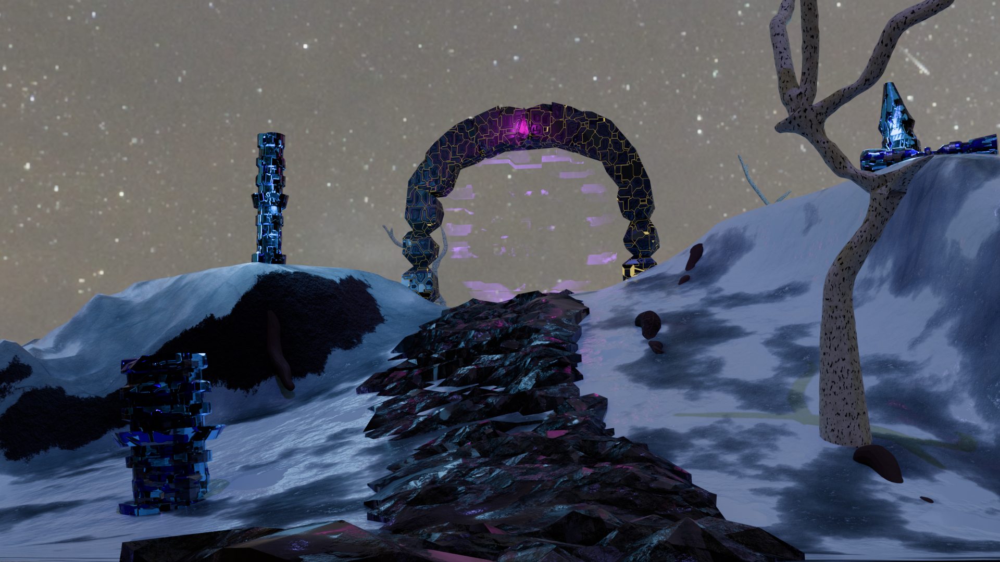

# Lab 07 – Biomechaniczny Teren

## Co zostało zrealizowane

Zbudowano scenę "wejście do podziemnego lasu" w Blenderze wyłącznie przy użyciu GUI (bez Pythona) Przejście jest przez portal, co dobrze wpasowuje się do poprzenich części labolatoriów z obcą planetą.

Scena zawiera kilka obiektów złożonych z prymitywów obrabianych w Edit Mode:
- nierówne podłoże (Plane z ręcznie przesuniętymi wierzchołkami),
- kolumny/filary z rozbudowaną górną częścią,
- centralny element bramowy (łuk) zbudowany z prymitywów z wieloma operacjami Extrude,
- drzewo oraz elementy skalne jako wypełnienie kompozycji.

Wykorzystano wszystkie wymagane operacje:
- **Extrude** — wielokrotnie na kolumnach i elemencie centralnym,
- **Loop Cut** — na podłożu i filarach,
- **Grab Z** — ręczne kształtowanie terenu,
- **Bevel** — zaokrąglenie krawędzi,
- **Scale**  — skalowanie ścian przy operacjach Extrude.

Oraz inne.

Zastosowano operacje na nodach w Shader Editor w celu nałożenia tekstur na obiekty — m.in. tekstury proceduralne dla efektu biomechanicznego i śnieżnego podłoża.

Render wykonano w silniku Cycles.

## Render wynikowy

