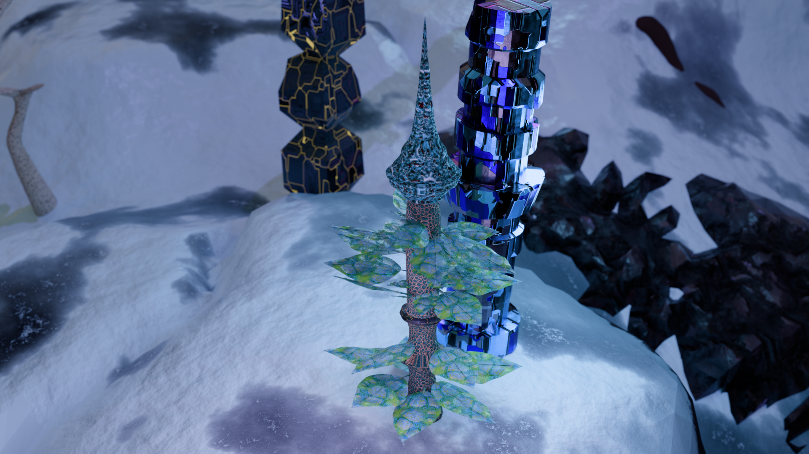

# Lab 07 – Biomechaniczna Roślina

## Co zostało zrealizowane

Zbudowano bio mechaniczną roślinę, podążając za wymaganiami z instrukcji. Do budowy rośliny wykorzystano filtry typu *mirror*, *array*, *subdivision surface*.
Model nie jest skomplikowany, ani zaawansowany z racji na ograniczenie kreatywności poprzez podążanie za konkretną treścia zadadnia.
Do modelu dodano dodatkowo tekstrury i wykonano zapis w formie dwóch zdjeć, jednej bez tła, i jednej z tłem z poprzedniej części Lab_06.

Wykorzystano wszystkie wymagane operacje.

Render wykonano w silniku Cycles.

## Render wynikowy

