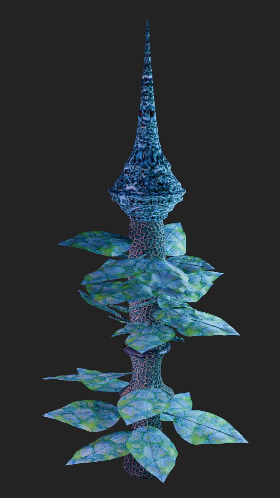

# Lab 08 – Materiały i Oświetlenie Organiczne

## Co zostało zrealizowane

Do sceny dodano oświetlenie rozłożone na kilka źródeł światła. Z racji że w poprzednich labach dodano już tekstury, nie były one już zmieniane. Tekstury dodano przy pomocy narzędzia Shaders, gdzie przy pomocy nodów nałożono pobrane z sieci tekstury.

HDRI dodano do sceny w Lab 6 [ostatni zrzut].

Wykorzystano wszystkie wymagane operacje.

Render wykonano w silniku Cycles.

## Render wynikowy

